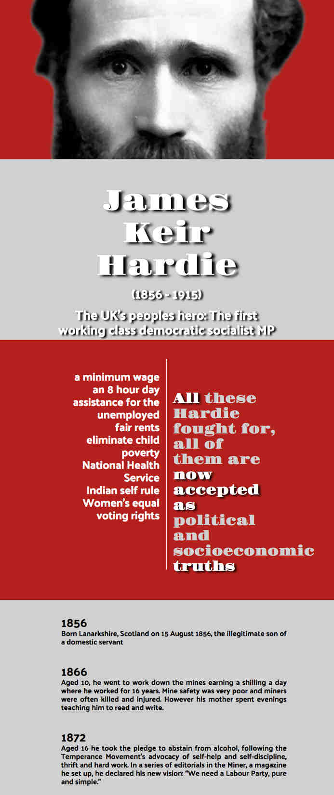

# k-hardie-tribute-page

Created for the Free Code Camp course

[User story can](https://www.freecodecamp.com/challenges/build-a-tribute-page)

  * view a tribute page with an image and text
  
  * click on a link that will take me to an external website with further information on the topic
  
only when I coded the page up did I discover that I was supposed to just use Bootstrap and HTML code...oops

Originaly I intended to create a tribute page on Bernie Sanders, but as he's a Yank and I'm a Brit, I did Kier Hardie instead.

